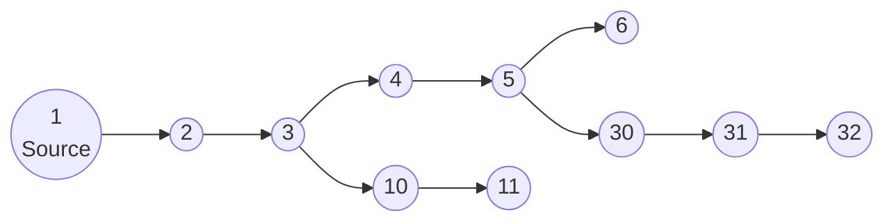

# HeatPilot-RL : Contrôle de réseau de chaleur par apprentissage par renforcement

Ce projet est un environnement de recherche simulant la physique d'un réseau de chaleur urbain (District Heating Network) couplé à un agent d'intelligence artificielle (Reinforcement Learning) dont le but est d'optimiser la production de chaleur.

Ce document a pour but d'expliquer :
- comment fonctionne le simulateur,
- quelles sont les équations et hypothèses physiques,
- quels ordres de grandeur issus de réseaux réels ont guidé le dimensionnement,
- comment l'IA apprend à piloter le réseau,
- et quelles sont les performances de l’agent entraîné.

---

## 1. Vue d'ensemble du problème

Un réseau de chaleur transporte de l'eau chaude depuis une centrale de production vers plusieurs consommateurs (bâtiments) via des canalisations.

Schéma du graphe principal utilisé dans `config.py` :




**Le défi :**  
- Les consommateurs ont une demande de puissance variable à laquelle l'agent doit s'adapter dynamiquement. Celle-ci est générée aléatoirement dans ce projet, mais la variation de puissance est censée être représentative (douche le matin, chauffage le soir...).
- L'eau met du temps à voyager dans les tuyaux (retard thermique). Une action prise à un moment $t$ ne se répercute qu'à $t+\Delta{t}$.
- Si on augmente trop la température ou le débit en entrée : la consommation énergétique (chauffage de l'eau, pompage) et les pertes thermiques (proportionnelles à la température du fluide) augmentent.
- Au contraire, si on diminue trop ces grandeurs : les consommateurs ont froid (inconfort).

**L'objectif de l'IA :**  
Anticiper les demandes et piloter la température et le débit à la source pour satisfaire les besoins tout en minimisant la consommation énergétique (chaudière + pompage).

---

## 2. Contexte de dimensionnement et ordres de grandeur

Cette section explique **les choix numériques du modèle** et montre qu’ils sont cohérents avec les données disponibles sur de vrais réseaux de chaleur.

### 2.1. Puissance du réseau "type"

Le réseau simulé représente un **petit réseau de chaleur** d’ordre de grandeur :

- **Puissance installée** : ~2 MW thermiques.
- **Nombre de sous-stations** : typiquement 5 à 10 nœuds consommateurs.

Ce choix est cohérent avec la typologie des réseaux en France :
- Les **petites chaufferies collectives** (quartiers résidentiels, petites communes) se situent généralement dans la gamme **0,5 à 3 MW**.
- À titre de comparaison réelle :
  - La chaudière biomasse de **Montigny-lès-Metz** fait **3,5 MW** [^1].
  - Le réseau d'**Hazebrouck** dispose d'une chaudière biomasse de **5 MW** [^2].
  - Les chaudières industrielles (ex: gamme Bosch Unimat ou Viessmann) couvrent couramment cette plage [^3].

Un réseau de 2 MW est donc représentatif d'une installation locale, bien loin des réseaux métropolitains comme la CPCU Paris (> 3 GW) ou ceux de La Défense (180 MW) [^4].

### 2.2. Températures aller / retour

Dans `config.py`, on utilise typiquement :
- Température de départ cible : **60–110 °C** (`CONTROL_LIMITS["temp_min"/"temp_max"]`),
- Température minimale de retour : **MIN_RETURN_TEMP = 40 °C**.

Ces valeurs respectent les standards actuels :
- Les réseaux classiques fonctionnent souvent en **90/70°C** ou **80/60°C**.
- Les réseaux basse température visent **70/40°C**.
- Le différentiel $\Delta T$ typique est de **20 à 50 K** [^5].

### 2.3. Débits et puissance de pompage

Dans `config.py`, le débit massique contrôlable est limité à :

- `flow_min = 1 kg/s`, `flow_max = 30 kg/s`.

Pour une puissance de 2 MW et un ΔT de 30 K (par exemple 80/50 °C), le débit massique requis est :

$$
\dot m \approx \frac{P}{c_p \Delta T}
       \approx \frac{2{\,}000}{4{,}18 \times 30}
       \approx 16\ \text{kg/s}
$$

Ce débit (16 kg/s, soit environ **57 m³/h**) est cohérent pour cette puissance.

Dans le modèle, la puissance de pompage est approximée par :
$$ P_{\text{pompe}}(t) = 1000 \cdot \dot m(t) $$

Cela correspond à une hypothèse de hauteur manométrique totale (HMT) d'environ **100 mètres de colonne d'eau (10 bar)** avec un rendement global de 60%, ce qui est un ordre de grandeur réaliste pour vaincre les pertes de charge d'un réseau de quelques kilomètres [^6].

### 2.4. Puissance demandée par bâtiment / nœud

`POWER_PROFILE_CONFIG` définit :

- `p_min = 100 kW`, `p_max = 300 kW` par nœud consommateur.

Cela correspond à la demande de pointe d'immeubles collectifs moyens (environ 70-100 W/m²). Par exemple, un immeuble de 3 000 m² appelle environ 200-300 kW par grand froid.

---

## 3. Modélisation physique (le simulateur)

Le cœur du code se trouve dans `district_heating_model.py`. Nous utilisons une approche unidimensionnelle basée sur la méthode des volumes finis.

### 3.1. Hypothèses simplificatrices

1. **Incompressibilité :**  
   L'eau est considérée incompressible. Le débit massique se propage instantanément dans tout le réseau (pas d’ondes de pression, pas de dynamique transitoire hydrauliques).
   - Pour de l’eau liquide à faible compressibilité, les vitesses typiques (0,5–2 m/s) et les variations de pression restent modérées. À l’échelle de temps thermique (secondes à minutes) la dynamique de pression est très rapide → on peut la considérer quasi-statique.

2. **Mélange parfait aux nœuds :**  
   Aux jonctions, les flux se mélangent instantanément.
   - Les volumes de mélange en chambre de sous-station ou collecteur sont faibles devant la longueur des canalisations, et les temps de mélange volumique sont négligeables à l’échelle de quelques secondes.

3. **Isolation uniforme :**  
   Les pertes thermiques linéiques sont modélisées par un coefficient `heat_loss_coeff` constant le long de chaque tuyau, tiré aléatoirement dans un intervalle raisonnable.
   - Dans les réseaux réels, les pertes sont de l’ordre de 5–15 % de l’énergie transportée sur une année.

4. **Conduction longitudinale négligée (facultative) :**  
   Le terme diffusif peut être activé, mais est généralement nul ou très faible. Le transport par **advection** domine dans des conduites avec $Re$ élevés.

5. **Pas de dynamique chaudière détaillée :**  
   La chaudière est modélisée comme un **producteur imposant une température de départ** et recevant un débit. Pas de bilans détaillés de combustion ou d’inertie du corps de chauffe.
   - Justification :  
     Pour le RL, l’essentiel est la relation entrée-sortie (T_in, ṁ → P_boiler) et les contraintes sur les rampes, plus que la transitoire interne de la chaudière.

### 3.2. L'Équation de la conduite

Chaque tuyau est divisé en petits segments de longueur $dx$. L'évolution de la température $T$ suit :

$$
\frac{\partial T}{\partial t}
= -v \frac{\partial T}{\partial x}
- \frac{4 h}{\rho c_p D}(T - T_{ext})
+ \alpha \frac{\partial^2 T}{\partial x^2}
$$

Où :
- $v$ : vitesse du fluide (m/s),
- $h$ : coefficient de perte thermique (W/m²/K),
- $D$ : diamètre du tuyau,
- $T_{ext}$ : température du sol,
- $\alpha = \lambda / (\rho c_p)$ : diffusivité thermique effective (souvent négligée).

**Discrétisation numérique (`Pipe.compute_derivatives`) :**

Pour une cellule i, on utilise un schéma **upwind** 1er ordre :

$$
\frac{dT_i}{dt}
= - \frac{\dot{m}}{\rho A dx}(T_i - T_{i-1})
  - \lambda (T_i - T_{ext})
$$

avec :

- $\dot{m}$ : débit massique (kg/s),
- $A$ : aire de section intérieure du tube,
- $\lambda = \frac{4 h}{\rho c_p D}$.

**Pourquoi un schéma upwind ?**
- Il est **numériquement stable** pour l’advection pure,
- Il respecte la direction physique du flux,
- Il évite les oscillations non physiques en présence de fronts de température marqués.

Le terme de diffusion peut être ajouté via un schéma à 3 points (Laplacien 1D).

### 3.3. Représentation du réseau et des nœuds

Le graphe du réseau est défini par `EDGES` dans `config.py` et représenté via `Graph` (`graph_utils.py`).

Les nœuds assurent :

1. **Conservation de la masse :**

$$
\sum \dot{m}_{in} = \sum \dot{m}_{out}
$$

Cette conservation est imposée par le routage des débits via les **fractions de split** aux nœuds de branchement.

2. **Mélange thermique :**

$$
T_{node} = \frac{\sum (\dot{m}_{in} T_{in})}{\sum \dot{m}_{in}}
$$

Calculé dans `_solve_nodes_temperature`.

3. **Soutirage de puissance aux nœuds consommateurs :**  
Pour chaque nœud consommateur, une puissance demandée $P_{demand}(t)$ est générée (profil en escalier).  
Le réseau fournit une puissance :

$$
P_{supplied} = \dot{m}_{in} c_p (T_{inlet} - T_{return})
$$

Dans `_apply_node_power_consumption`, on impose une chute de température locale :

$$
T_{\text{out}} = \max\left(T_{\text{in}} - \frac{P_{\text{supplied}}}{\dot{m}_{\text{in}} c_p},\ T_{\text{min return}}\right)
$$

avec $T_{\text{min return}} =$ `MIN_RETURN_TEMP` (40 °C), bornant la température de retour.

**Justification de $T_{\text{min return}}$ :**
- Physiquement, le transfert thermique s'arrête quand la température primaire atteint celle du retour secondaire.
- Dans une sous-station réelle, les deux circuits (primaire réseau et secondaire bâtiment) ne se mélangent pas. L'échangeur à plaques transfère la chaleur. La température de retour primaire dépend de la performance de l'échangeur et de la demande [^9].

---

## 4. L'Environnement RL (Gymnasium)

Le fichier `district_heating_gym_env.py` fait le lien entre la physique et l'IA.

### 4.1. Agent et horizon temporel

- Un épisode représente **une journée** : `t_max_day = 24h`.
- Pas de contrôle : `dt = 10 s` (dans la config par défaut).

### 4.2. Espace d’Observation (ce que l’agent voit)

L’observation est un vecteur contenant :

1. Température actuelle aux nœuds consommateurs (feedback retardé par le transport).
2. Température actuelle de départ à la source.
3. Débit massique actuel.
4. Demande de puissance courante pour chaque consommateur.

Ces informations suffisent pour :
- Estimer l’état thermique actuel du réseau (via les températures de retour),
- Connaître la demande instantanée,
- Adapter T_in et ṁ pour anticiper les variations de charge.

### 4.3. Espace d’Action (ce que l’agent contrôle)

L’action est un vecteur continu :

1. **Target Temperature** : consigne de température à la source.
2. **Target Flow** : débit massique cible.
3. **Splits** : répartition des débits.

**Ramping / contraintes dynamiques (Gradient de température) :**

Pour garantir le réalisme physique et protéger le matériel simulé, des contraintes de variation (ramping) sont imposées. Elles sont basées sur les limites techniques des chaudières industrielles :

- **Montée en température** : Limitée à environ **+0,5 à +1,5 °C par 10 secondes**.
  - *Source* : Les chaudières eau chaude tolèrent des gradients de 3 à 8 K/min (biomasse) voire 10-15 K/min (gaz rapide), soit environ +0,5 à +2,5 °C/10s [^10].
- **Descente en température** : Limitée à environ **-0,2 à -0,8 °C par 10 secondes**.
  - *Justification* : Le refroidissement est plus lent (inertie thermique, pas de refroidissement actif par le brûleur). Une chute brutale (choc thermique à l'eau froide) est dangereuse pour le corps de chauffe [^11].

Ces bornes (`max_temp_rise_per_dt`, `max_temp_drop_per_dt`) empêchent l'agent d'adopter des stratégies "bang-bang" irréalistes qui endommageraient une vraie chaufferie.

### 4.4. Fonction de Coût / Récompense

La récompense est construite pour équilibrer le confort thermique et la sobriété énergétique. Elle est définie dans `config.py` (`REWARD_CONFIG`) et calculée à chaque pas de temps.

$$
Reward = r_{\text{confort}} + r_{\text{sobriété\_prod}} + r_{\text{sobriété\_pompe}}
$$

1. **Confort ($r_{\text{confort}}$)** : Pénalise linéairement la **sous-production** uniquement (les consommateurs ont froid). La sur-production n'est pas pénalisée ici (elle l'est dans le terme de sobriété).
   $$ r_{\text{confort}} = - A \times \frac{\max(0, P_{\text{demand}} - P_{\text{supplied}})}{P_{\text{ref}}} $$

2. **Sobriété Production ($r_{\text{sobriété\_prod}}$)** : Pénalise linéairement la **sur-production** (gaspillage d'énergie chaudière).
   $$ r_{\text{sobriété\_prod}} = - B \times \frac{\max(0, P_{\text{boiler}} - P_{\text{demand}})}{P_{\text{ref}}} $$

3. **Sobriété Pompage ($r_{\text{sobriété\_pompe}}$)** : Pénalise l'écart à la **puissance nominale** (quadratique) et ajoute une pénalité linéaire pour tout excès au-delà du nominal. Cela incite la pompe à travailler autour de son point de fonctionnement optimal.
   $$ r_{\text{sobriété\_pompe}} = - C \times \left[ \left(\frac{P_{\text{pump}} - P_{\text{nom}}}{P_{\text{nom}}}\right)^2 + \max\left(0, \frac{P_{\text{pump}} - P_{\text{nom}}}{P_{\text{nom}}}\right) \right] $$

**Poids actuels (`config.py`) :**
- $A = 1.0$ (Confort)
- $B = 1.0$ (Sobriété Chaudière)
- $C = 0.5$ (Sobriété Pompe)
- $P_{\text{ref}} = 2000$ kW
- $P_{\text{nom}} = 15$ kW

### 4.5. Paramètres d'Apprentissage (PPO)

Pour favoriser l'exploration et la convergence :
- **Normalisation** : `normalize_env = False` (Désactivé dans la configuration actuelle).
- **Entropie** : Un coefficient d'entropie (`ent_coef = 0.05`) force l'agent à explorer davantage au début.
- **Horizon** : La mise à jour du réseau de neurones se fait tous les 2048 pas (~6h simulées) pour stabiliser le gradient.

---

## 5. Architecture du Code

Voici comment les fichiers interagissent :

```text
.
├── config.py                       # Paramètres globaux : topologie, physique, RL, récompenses.
├── district_heating_model.py       # Moteur physique : classes Pipe et DistrictHeatingNetwork.
├── graph_utils.py                  # Structure de graphe et topologie.
├── district_heating_gym_env.py     # Environnement Gym : interface physique <-> RL.
├── train_agent.py                  # Entraînement PPO avec menu interactif et gestion de config.
├── reward_plot.py                  # Outil interactif pour visualiser et régler la fonction de récompense.
├── evaluate_agent.py               # Évaluation d'un agent entraîné + génération de graphiques.
├── run_district_heating_simulation.py # Simulation déterministe "sans IA".
└── utils.py                        # Fonctions utilitaires.
```

---

## 6. Comment lancer le projet ?

### 6.1. Pré-requis

Assurez-vous d'avoir installé les dépendances :

```bash
pip install numpy scipy matplotlib gymnasium stable-baselines3 s3fs
```

### 6.2. Étape 1 : Régler la Récompense (Optionnel)

Utilisez l'outil interactif pour visualiser l'impact des poids $A, B, C$ sur la récompense en fonction de la puissance fournie et du débit :

```bash
python reward_plot.py
```

### 6.3. Étape 2 : Vérifier la physique

Lancez une simulation simple sans IA pour voir comment le réseau réagit thermiquement :

```bash
python run_district_heating_simulation.py
```

Cela :
- crée un réseau avec des conduites et pertes générées aléatoirement mais reproductibles,
- applique des profils de puissance aux nœuds consommateurs,
- calcule et trace :

  - la puissance totale demandée,
  - la puissance totale effectivement soutirée,
  - la puissance fournie par la chaudière,
  - la puissance de pompage (si vous ajoutez son tracé).

**[TODO FIGURE 1]**  
À cet endroit, vous pouvez insérer un graphique `power_balance.png` illustrant :
- $P_{demand\_tot}$,
- $P_{supplied\_tot}$,
- $P_{boiler}$,
en fonction du temps. Il est déjà en partie généré dans `run_district_heating_simulation.py`.

### 6.4. Étape 3 : Entraîner l'IA

Lancez l'apprentissage :

```bash
python train_agent.py
```

Le script propose un **menu interactif** :
1. **Créer un nouveau modèle** : Sauvegarde la configuration actuelle (`config.py`) dans un fichier `run_config.json` associé au modèle pour garantir la reproductibilité.
2. **Reprendre un entraînement** : Charge automatiquement la configuration `run_config.json` du modèle existant pour continuer l'entraînement avec les mêmes paramètres.

- Le modèle final sera sauvegardé dans `models/PPO_nom_du_run/`.
- Des checkpoints intermédiaires sont créés régulièrement.

### 6.5. Étape 4 : Évaluer et Visualiser

Une fois l'entraînement fini, regardez comment l'agent se comporte sur un scénario de test :

```bash
python evaluate_agent.py
```

- Cela génère `evaluation_results.png` avec :
  - température de départ,
  - températures aux nœuds consommateurs,
  - débit,
  - récompense instantanée.

**[TODO FIGURE 2]**  
Insérer ici un exemple d’`evaluation_results.png` montrant :
- le suivi des températures noeuds vs consigne,
- le débit piloté,
- l’évolution de la récompense.

---

## 7. Topologie du Réseau (Exemple)

La topologie est définie dans `config.py` via la liste `EDGES`.

Exemple simple linéaire :

```text
[Source 1] ====> [Noeud 2] ====> [Consommateur 3]
```

Exemple avec branchement :

```text
                 /===> [Consommateur 4]
[Source 1] ===> [Noeud 2]
                 \===> [Consommateur 3]
```

Le fichier `graph_utils.py` analyse automatiquement ces connexions pour :
- identifier le noeud d’entrée (source),
- repérer les nœuds de branchement,
- déterminer un **ordre topologique** de calcul des débits.

---

## 8. Analyse prévue des performances de l’agent RL (à compléter)

Cette section décrit la structure d’analyse à mettre en place une fois que vous aurez suffisamment de modèles entraînés.

### 8.1. Métriques globales

À calculer sur un épisode de test :

- **Énergie totale demandée** vs fournie (intégrale de $P_{demand\_tot}$ et $P_{supplied\_tot}$).
- **Énergie chaudière** (intégrale de $P_{boiler}(t)$).
- **Énergie de pompage** (intégrale de $P_{pump}(t)$).
- **Écart confort moyen et max** :

$$
\frac{1}{T}\int \left|P_{\text{supplied}}(t) - P_{\text{demand}}(t)\right| \,\mathrm{d}t
$$

- **Récompense cumulée** sur l’épisode.

**[TODO FIGURE 3]**  
Graphique : `energy_breakdown.png` montrant, pour un épisode :
- énergie demandée (kWh),
- énergie fournie,
- énergie chaudière,
- énergie pompage,
pour une politique RL vs une politique de référence (par ex. température et débit constants).

### 8.2. Profils temporels

Analyser :

- la trajectoire de la température de départ,
- le débit massique,
- les températures de retour aux nœuds,
- la réponse du réseau à des marches de demande.

**[TODO FIGURE 4]**  
Graphique multi-panneaux :
- (a) T_in(t) et T_consommateurs(t),
- (b) ṁ(t),
- (c) P_demand_tot(t) et P_supplied_tot(t),
- (d) Reward(t).

Ces courbes sont en grande partie déjà disponibles via `evaluate_agent.py`. Il suffira éventuellement de compléter le script pour exporter des données au format `.npz` ou `.csv` et tracer avec un notebook.

### 8.3. Comparaison avec des stratégies baselines

Comparer la politique RL avec :

1. **Stratégie naïve** :  
   - T_in fixe (par ex. 90 °C),
   - ṁ fixe (débit max ou débit dimensionné pour ΔT=20K),
   - splits uniformes.
2. **Stratégie “loi d’eau” simplifiée** :  
   - T_in modulée en fonction d’une température extérieure synthétique,
   - ṁ constant.

Pour chaque stratégie, calculer :
- les mêmes métriques globales,
- l’écart de performance relatif (gain en % sur la consommation d’énergie pour un même confort).

**[TODO TABLEAU 1]**  
Insérer un tableau récapitulatif :

| Stratégie        | Énergie chaudière (kWh) | Énergie pompe (kWh) | Écart confort moyen (kW) | Récompense cumulée |
|------------------|-------------------------|----------------------|--------------------------|--------------------|
| Naïve            | …                       | …                    | …                        | …                  |
| Loi d’eau        | …                       | …                    | …                        | …                  |
| RL (HeatPilot)   | …                       | …                    | …                        | …                  |

### 8.4. Robustesse et généralisations

Pistes d’analyse supplémentaires (à implémenter plus tard) :

- **Robustesse à des profils de demande non anticipés** : tester avec des scénarios de demande différents de ceux vus pendant l’entraînement.
- **Généralisation à d’autres topologies** : appliquer à des réseaux avec une topologie différente (plus ou moins de nœuds, configurations en étoile, maillées, etc.).
- **Sensibilité aux paramètres** : variation systématique des paramètres (plages de température, capacités, etc.) pour évaluer l’impact sur la performance de l’agent.

---

## 9. Limitations Connues et Améliorations Futures

1. **Approximation de l'hydraulique :**  
   Le modèle actuel ne prend pas en compte la dynamique hydraulique détaillée (hauteur manométrique variable, pertes de charge non linéaires, etc.). Une modélisation plus précise pourrait améliorer la réalité des simulations.

2. **Modèle de chaudière simplifié :**  
   La chaudière est modélisée de manière simplifiée. Un modèle plus détaillé tenant compte des transitoires internes et des dynamiques de combustion pourrait être bénéfique.

3. **Pas de gestion avancée des incertitudes :**  
   Le modèle ne gère pas encore les incertitudes sur les demandes ou les temps de transport. L'intégration de telles incertitudes pourrait rendre l'agent RL plus robuste.

4. **Scalabilité :**  
   Bien que le modèle soit conçu pour être extensible, des tests sont nécessaires pour des réseaux beaucoup plus grands ou des simulations à très long terme.

5. **Amélioration de l'interface utilisateur :**  
   Développement d'interfaces plus conviviales pour la configuration des simulations, l'entraînement des agents et l'analyse des résultats.

---

## 10. Références et Sources

Les données techniques utilisées pour le dimensionnement proviennent de la littérature spécialisée sur les réseaux de chaleur :

[^1]: UEM Metz, [Biomasse Montigny-lès-Metz](https://www.uem-metz.fr/accueil-chauffage-urbain/biomasse-montigny/)
[^2]: Bioénergie Promotion, [Réseau de chaleur d'Hazebrouck](https://www.bioenergie-promotion.fr/96923/le-reseau-de-chaleur-dhazebrouck-maitrise-son-prix-de-lenergie-grace-a-la-biomasse/)
[^3]: Bosch Industrial, [Chaudières industrielles](https://www.bosch-industrial.com/fr/fr/ocs/tertiaire-et-industrie/chaudieres-industrielles-669462-c/)
[^4]: France Chaleur Urbaine, [Données CPCU](https://france-chaleur-urbaine.beta.gouv.fr/reseaux/7501C)
[^5]: CIBE, [Optimisation des réseaux de chaleur](https://cibe.fr/wp-content/uploads/2017/02/51-rct34_optimisationrc.pdf)
[^6]: Xpair, [Solution pompage réseau de chaleur](https://conseils.xpair.com/consulter_savoir_faire/reseaux-chaleur-froid/solution-pompage.htm)
[^7]: Hargassner, [Brochure chaudière industrie](https://www.hargassner.com/wp-content/uploads/2023/10/brochure-chaudiere-industry-hargassner-1.pdf)
[^8]: Babcock Wanson, [Chaudières tubes de fumées](https://www.babcock-wanson.com/fr/categorie-produit/chaudieres-tubes-de-fumees/)
[^9]: Xpair, [Sous-stations réseaux chaleur](https://conseils.xpair.com/consulter_savoir_faire/chauffage-urbain-reseaux-chaleur-multi-energies/sous-stations-reseaux-chaleur.htm)
[^10]: Weishaupt, [Notice technique brûleurs](https://www.weishaupt.fr/uploads/tx_weishaupt_documents/documents/83314504.pdf)
[^11]: National Board, [Preventing Thermal Shock](https://www.nationalboard.org/index.aspx?pageID=164&ID=232)

---

## 11. Remerciements

- À l'équipe de recherche pour le soutien et les retours.
- À la communauté open-source pour les outils et bibliothèques utilisés.

---

## 12. Contact

Pour toute question ou suggestion, contacter : [votre.email@exemple.com]