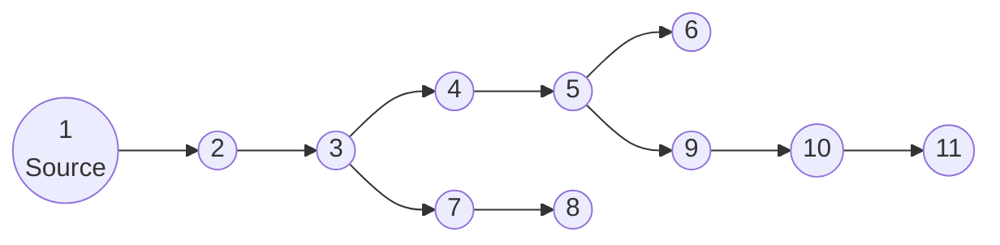

# HeatPilot-RL : Contrôle de réseau de chaleur par apprentissage par renforcement

Ce projet est un environnement de recherche simulant la physique d'un réseau de chaleur urbain (District Heating Network) couplé à un agent d'apprentissage par renforcement (Reinforcement Learning) dont le but est d'optimiser la production de chaleur.

> **Note :** Ce projet n'a potentiellement que très peu d'intérêt pour la gestion seule d'un réseau de chaleur classique. Toutefois, cette approche peut être très pertinente dans le cas où on peut piloter des moyens de stockage de la chaleur, des moyens de productions intermittents (solaire thermique), ou de la récupération de chaleur fatale dans une usine.

Ce document a pour but d'expliquer :
- comment fonctionne le simulateur,
- quelles sont les équations et hypothèses physiques,
- quels ordres de grandeur issus de réseaux réels ont guidé le dimensionnement,
- comment l'agent apprend à piloter le réseau,
- et quelles sont les performances de l’agent entraîné.

---

## 1. Vue d'ensemble du problème

Un réseau de chaleur transporte de l'eau chaude depuis une centrale de production vers plusieurs consommateurs (bâtiments) via des canalisations.

Schéma du réseau de chaleur utilisé (dans `config.py`) :




**Le défi :**  
- Les consommateurs ont une demande de puissance variable à laquelle l'agent doit s'adapter dynamiquement. Celle-ci est générée aléatoirement dans ce projet, mais la variation de puissance est censée être représentative (douche le matin, chauffage le soir...).
- L'eau met du temps à voyager dans les tuyaux (retard thermique). Une décision de mofifier la température d'entrée prise à un moment $t$ ne se répercute qu'à $t+\Delta{t}$.
- Si on augmente trop la température ou le débit en entrée : la consommation énergétique (chauffage de l'eau, pompage) et les pertes thermiques (proportionnelles à la température du fluide) augmentent.
- Au contraire, si on diminue trop ces grandeurs : les consommateurs ont froid (inconfort).

**L'objectif de l'IA :**  
Satisfaire dynamiquement la demande de puissance thermique des consommateurs en pilotant la température et le débit à la source ainsi que l'ouverture des vannes aux noeuds de branchement, tout en minimisant la consommation énergétique (chaudière + pompage).

Aucun profil de puissance réaliste n'ayant été implémenté, le but de l'agent n'est réellement d'anticiper les variations de la demande (du moins pas à long terme), mais vraiment de s'y adapter en live.

Le but même de l'exercice n'est donc pas représentatif de la réalité : dans celle-ci, la demande est normalement prédite puis on met en place un contrôle du réseau devant se rapprocher de cette prédiction, pas forcément de s'adapter dynamiquement à la demande en temps réel.

---

## 2. Contexte de dimensionnement et ordres de grandeur

Cette section explique **les choix numériques du modèle** et montre qu’ils sont cohérents avec les données disponibles sur de vrais réseaux de chaleur.

### 2.1. Puissance du réseau type

Le réseau simulé représente un **petit réseau de chaleur** d’ordre de grandeur :

- **Puissance installée** : ~2 MW thermiques.
- **Nombre de sous-stations** : typiquement 5 à 10 nœuds consommateurs.

Ce choix est cohérent avec la typologie des réseaux en France :
- Les **petites chaufferies collectives** (quartiers résidentiels, petites communes) se situent généralement dans la gamme **0,5 à 3 MW**.
- À titre de comparaison réelle :
  - La chaudière biomasse de Montigny-lès-Metz fait 3,5 MW [^1].
  - Le réseau d'Hazebrouck dispose d'une chaudière biomasse de 5 MW [^2].
  - Les chaudières industrielles (ex: gamme Bosch Unimat ou Viessmann) couvrent couramment cette plage [^3].

Un réseau de 2 MW est donc représentatif d'une installation locale, bien loin des réseaux métropolitains comme la CPCU Paris (> 3 GW) ou ceux de La Défense (180 MW) [^4].

### 2.2. Températures aller / retour

Dans `config.py`, on utilise typiquement :
- Température de départ : comprise entre `temp_min = 50.0 °C` et `temp_max = 120.0 °C`. Ce sont des bornes larges, l'agent doit ne décidera d'exploiter qu'une certaine amplitude de la plage.
- Température de retour : `min_return_temp = 40 °C`, un consommateur ne pourra pas soutirer de chaleur au réseau si la température de l'eau l'approvisionnant est inférieure ou égale à cette valeur. Par ailleurs, on considère que si la température des noeuds terminaux (en fin de réseau) excède cette température, alors on a perdu de la puissance inutilement. Il s'agit vraiment d'une température cible pour l'agent.
- Régime transitoire et warmup : Par défaut, le réseau subit une phase de mise en chauffe de plusieurs heures (simulées) avant que l'agent ne prenne le contrôle. Durant cette phase, la température d'entrée et le débit sont maintenus constants. L'agent récupère donc un réseau déjà stabilisé ("chaud") et n'a pas à apprendre la procédure de démarrage, ce qui simplifie l'apprentissage de la régulation.

Ces valeurs respectent les standards actuels :
- Les réseaux classiques fonctionnent souvent en **90/70°C** ou **80/60°C**.
- Les réseaux basse température visent **70/40°C**.
- Le différentiel $\Delta T$ typique est de **20 à 50 K** [^5].

### 2.3. Débits et puissance de pompage

Dans `config.py`,
- Le débit massique contrôlable est limité à `flow_min = 3 kg/s`, `flow_max = 30 kg/s`.

Pour une puissance de 2 MW et un ΔT de 30 K (par exemple 80/50 °C), le débit massique requis est :

$$
\dot m \approx \frac{P}{c_p \Delta T}
       \approx \frac{2{\,}000}{4{,}18 \times 30}
       \approx 16\ \text{kg/s}
$$

Ce débit (16 kg/s, soit environ **57 m³/h**) est cohérent pour cette puissance.

Dans le modèle, la **puissance de pompage** est approximée par :
$$P_{\text{pompe}}(t) = 1000 \cdot \dot m(t)$$

Cela correspond à une hypothèse de hauteur manométrique totale (HMT) d'environ 100 mètres de colonne d'eau (10 bar) avec un rendement global de 60%, ce qui est un ordre de grandeur réaliste pour vaincre les pertes de charge d'un réseau de quelques kilomètres [^6].

### 2.4. Puissance demandée par bâtiment / nœud

Dans `config.py`, `POWER_PROFILE_CONFIG` définit :

- `p_min = 100 kW`, `p_max = 300 kW` par nœud consommateur.

Cela correspond à la demande de pointe d'immeubles collectifs moyens (environ 70-100 W/m²). Par exemple, un immeuble de 3 000 m² appelle environ 200-300 kW par grand froid.

Encore une fois, les profils de demande sont générés complètement aléatoirement : toutes les heures, une valeur de puissance est tirée au sort pour chaque noeud. On fait en sorte que les profils soient "lisses" (pas de fonction en escalier).

---

## 3. Modélisation physique (le simulateur)

Le cœur du modèle physique se trouve dans `district_heating_model.py`. Une approche unidimensionnelle basée sur la méthode des volumes finis est utilisée.

### 3.1. Hypothèses simplificatrices

1. **Incompressibilité :**  
   L'eau est considérée incompressible. Le débit massique se propage instantanément dans tout le réseau (pas d’ondes de pression, pas de dynamique transitoire hydrauliques).
   - Pour de l’eau liquide à faible compressibilité, les vitesses typiques (0,5–2 m/s) et les variations de pression restent modérées. À l’échelle de temps thermique (secondes à minutes) la dynamique de pression est très rapide → on peut la considérer quasi-statique.

2. **Mélange parfait aux nœuds :**  
   Aux jonctions, les flux se mélangent instantanément.
   - Les volumes de mélange en chambre de sous-station ou collecteur sont faibles devant la longueur des canalisations, et les temps de mélange volumique sont négligeables à l’échelle de quelques secondes.

3. **Isolation uniforme :**  
   Les pertes thermiques linéiques sont modélisées par un coefficient `heat_loss_coeff` constant le long de chaque tuyau, tiré aléatoirement dans un intervalle raisonnable.
   - Dans les réseaux réels, les pertes sont de l’ordre de 5–15 % de l’énergie transportée sur une année.

4. **Conduction longitudinale négligée (facultative) :**  
   Le terme diffusif peut être activé, mais est généralement nul ou très faible. Le transport par **advection** domine dans des conduites avec $Re$ élevés.

### 3.2. L'équation de la conduite

Chaque tuyau est divisé en petits segments de longueur $dx$. L'évolution de la température $T$ suit :

$$\frac{\partial T}{\partial t}= -v \frac{\partial T}{\partial x}- \frac{4 h}{\rho c_p D}(T - T_{ext})+ \alpha \frac{\partial^2 T}{\partial x^2}$$

Où :
- $v$ : vitesse du fluide (m/s),
- $h$ : coefficient de perte thermique (W/m²/K),
- $D$ : diamètre du tuyau,
- $T_{ext}$ : température du sol,
- $\alpha = \lambda / (\rho c_p)$ : diffusivité thermique effective (souvent négligée).

**Discrétisation numérique (`Pipe.compute_derivatives`) :**

Pour une cellule i, on utilise un schéma upwind 1er ordre :

$$\frac{dT_i}{dt}= - \frac{\dot{m}}{\rho A dx}(T_i - T_{i-1})- \lambda (T_i - T_{ext})$$

avec :

- $\dot{m}$ : débit massique (kg/s),
- $A$ : aire de section intérieure du tube,
- $\lambda = \frac{4 h}{\rho c_p D}$.

Le terme de diffusion peut être ajouté via un schéma à 3 points (Laplacien 1D).

### 3.3. Représentation du réseau et des nœuds

Le graphe du réseau est défini par `EDGES` dans `config.py` et représenté via `Graph` (`graph_utils.py`).

Les nœuds assurent :

1. **Conservation de la masse :**

$$
\sum \dot{m}_{in} = \sum \dot{m}_{out}
$$

Cette conservation est imposée par le routage des débits via les **fractions de split** aux nœuds de branchement.

2. **Mélange thermique :**

$$
T_{node} = \frac{\sum (\dot{m}_{in} T_{in})}{\sum \dot{m}_{in}}
$$

Calculé dans `_solve_nodes_temperature`.

3. **Soutirage de puissance aux nœuds consommateurs :**  
Pour chaque nœud consommateur, une puissance demandée $P_{demand}(t)$ est générée (profil en escalier).  
Le réseau fournit une puissance :

$$
P_{supplied} = \dot{m}_{in} c_p (T_{inlet} - T_{return})
$$

Dans `_apply_node_power_consumption`, on impose une chute de température locale :

$$
T_{\text{out}} = \max\left(T_{\text{in}} - \frac{P_{\text{supplied}}}{\dot{m}_{\text{in}} c_p},\ T_{\text{min return}}\right)
$$

avec $T_{\text{min return}} =$ `MIN_RETURN_TEMP` (40 °C), bornant la température de retour (physiquement, le transfert thermique s'arrête quand la température du circuit primaire (réseau de chaleur) atteint celle du circuit secondaire (immeuble)).

---

## 4. L'Environnement RL (gymnasium)

Le fichier `district_heating_gym_env.py` fait le lien entre la physique et l'IA.

### 4.1. Agent et horizon temporel

- Un épisode représente **une journée** : `t_max_day = 24h`.
- Pas de contrôle : `dt = 60 s` (l'agent prend une décision toutes les 60s.).

### 4.2. Espace d’observation

L’observation est un vecteur contenant :

1. **Températures actuelles** de tous les nœuds du réseau (source, consommateurs).
2. **Débits massiques actuels** dans chacune des conduites.
3. **Demandes de puissance** courantes pour chaque consommateur.

Ces informations suffisent pour :
- Estimer l’état thermique actuel du réseau,
- Connaître la demande instantanée,
- Adapter $T_{in}$, $\dot m$ et les fractions de split pour anticiper les variations de charge.

### 4.3. Espace d’action

L’action est un vecteur continu normalisé entre [-1, 1]. Plutôt que de choisir une valeur cible absolue, l'agent choisit une **variation** (delta) à appliquer à l'état courant :

1.  **Variation de température** ($\Delta T$) : Pourcentage de la rampe maximale autorisée.
2.  **Variation de débit** ($\Delta \dot{m}$) : Pourcentage de la rampe maximale autorisée.
3.  **Variation des vannes** ($\Delta \text{split}$) : Pourcentage de la vitesse d'ouverture/fermeture maximale (pour chaque nœud de branchement).

**Rampes autorisées (contraintes dynamiques) :**

Pour garantir le réalisme physique et protéger le matériel simulé, ces variations sont bornées par des contraintes configurées dans `config.py`. Les limites typiques sont :

-   **Température** : Variation max de **±3.0 °C / min**.
    -   Les chaudières tolèrent des gradients limités pour éviter les chocs thermiques [^10].
-   **Débit** : Variation max de **±3.0 kg/s / min**.
-   **Vannes** : Variation max de **±10% d'ouverture / min**.

Ces bornes empêchent l'agent d'adopter des stratégies tout ou rien irréalistes et dangereuses pour les équipements.

### 4.4. Fonction de coût / récompense

La fonction de récompense combine des pénalités linéaires (pour éloigner l'agent des zones critiques) et des bonus gaussiens (pour affiner la convergence vers l'optimum). Un terme de "combo" est également intégré pour favoriser l'atteinte simultanée des objectifs de confort et de sobriété.

$$\text{Reward} = \text{R}_{\text{confort}} + \text{R}_{\text{sobriété}} + \text{R}_{\text{combo}} + \text{R}_{\text{pompe}} + \text{R}_{\text{vannes}}$$

Détail des termes :

1.  **Confort ($R_{confort}$)** :
    *   **Pénalité linéaire** : punit le déficit de puissance (demande non satisfaite ~$P_{demande} - P_{fourni}$).
    *   **Bonus gaussien** : récompense lorsque le déficit est proche de 0 (cible atteinte).
    *   Pondération : `weights["comfort"]`.

2.  **Sobriété ($R_{sobriété}$)** :
    *   **Pénalité linéaire** : punit la chaleur gaspillée (produite mais non consommée, perdue dans le retour).
    *   **Bonus gaussien** : récompense lorsque le gaspillage est proche de 0.
    *   Pondération : `weights["waste"]`.

3.  **Bonus Combo ($R_{combo}$)** :
    *   Récompense élevée (`combo_bonus`) attribuée uniquement si le confort est assuré (déficit < seuil) ET la sobriété est respectée (gaspillage < seuil). Cela aide l'agent à stabiliser un point de fonctionnement optimal.

4.  **Pompage ($R_{pompe}$)** :
    *   **Bonus gaussien** centré sur une puissance de pompe nominale (`p_pump_nominal`). L'agent est incité à utiliser un débit raisonnable, ni trop faible (inefficace thermiquement), ni trop élevé (consommation électrique excessive).
    *   Pondération : `weights["pump"]`.

5.  **Guidage vannes ($R_{vannes}$)** :
    *   Terme d'aide à l'apprentissage (curriculum learning implicite). Il compare l'ouverture des vannes choisie par l'agent avec une **heuristique proportionnelle à la demande**.
    *   Cette heuristique calcule la somme des puissances demandées en aval de chaque branche d'une intersection, et définit l'ouverture idéale (fraction de débit) comme le prorata de ces demandes. Si une branche dessert 80% de la demande totale aval, elle reçoit 80% du débit.
    *   L'agent reçoit un fort bonus (+2.0) s'il est proche de cette consigne (écart < 5%), ce qui l'aide à ne pas explorer des configurations hydrauliques absurdes au début.

**Poids actuels (`config.py`) :**
- Confort : 4
- Sobriété : 2
- Pompe : 5
- Combo : 10

### 4.5. Paramètres d'apprentissage (PPO)

Pour favoriser l'exploration et la convergence :
- **Normalisation** : `normalize_env = True` (aide énormément la convergence et l'exploration).
- **Entropie** : un coefficient d'entropie relativement faible (`ent_coef = 0.0005`) a été choisi, l'environnement étant totalement déterministe.
- **Horizon** : la mise à jour du réseau de neurones se fait tous les 1440 pas (24h simulées, soit un épisode complet) pour stabiliser le gradient sur une journée entière.

---

## 5. Architecture du code

Voici comment les fichiers interagissent :

```text
.
├── config.py                       # Paramètres globaux : topologie, physique, RL, récompenses.
├── district_heating_model.py       # Moteur physique : classes Pipe et DistrictHeatingNetwork.
├── run_district_heating_simulation.py # Simulation déterministe "sans IA".
├── district_heating_gym_env.py     # Environnement Gym : interface physique <-> RL.
├── train_agent.py                  # Entraînement PPO avec menu interactif et gestion de config.
├── evaluate_agent.py               # Évaluation détaillée d'un modèle spécifique (profils temporels).
├── evaluate_2_agent.py             # Évaluation de synthèse sur plusieurs itérations d'un même modèle (courbes d'apprentissage).
├── graph_utils.py                  # Structure de graphe et topologie.
├── utils.py                        # Fonctions utilitaires.
├── \models                         # Dossier pour ranger les modèles entraînés
└── \plots                          # Dossier pour ranger les plots
```

---

## 6. Comment lancer le projet ?

### 6.1. Pré-requis

Assurez-vous d'avoir installé les dépendances :

```bash
pip install numpy scipy matplotlib gymnasium stable-baselines3
```

### 6.2. Étape 1 : vérifier la physique

Lancez une simulation simple sans IA pour voir comment le réseau réagit thermiquement :

```bash
python run_district_heating_simulation.py
```

Cela :
- crée un réseau avec des conduites et pertes générées aléatoirement mais reproductibles,
- applique des profils de puissance aux nœuds consommateurs,
- calcule et trace deux graphiques de synthèse :

  1. **Contrôle à la source** : Affiche l'évolution conjointe de la température de départ ($T_{in}$) et du débit massique ($\dot{m}$), ainsi que l'ouverture des vannes si elles sont pilotées.
  2. **Bilan énergétique** : Compare dynamiquement la demande totale des consommateurs, la puissance réellement fournie, et les pertes thermiques, permettant d'identifier visuellement les périodes de déficit (inconfort) ou de surchauffe (gaspillage).
 
Les graphes suivants ont été tracés avec une température d'entrée constante `inlet_temp = 75 °C` et un débit massique constant `inlet_mass_flow = 15 kg/s`.

Les fractions massiques aux branchements ont été spécifiés, mais demeurent constantes tout le long de la simulation.


### 6.3. Étape 3 : Entraîner l'IA

Lancez l'apprentissage :

```bash
python train_agent.py
```

Le script propose un menu interactif :
1. **Créer un nouveau modèle** : sauvegarde la configuration actuelle (`config.py`) dans un fichier `run_config.json` associé au modèle pour garantir la reproductibilité.
2. **Reprendre un entraînement** : permet de choisir le dossier d'un modèle existant et charge sa configuration `run_config.json` pour continuer l'entraînement avec les mêmes paramètres.

- Le modèle final sera sauvegardé dans `models/PPO_nom_personnalisé/`.
- Des checkpoints intermédiaires sont créés régulièrement. Ils sont numérotés par le nombre d'itérations sur la politique de l'agent.

### 6.4. Étape 4 : évaluer et visualiser

Une fois l'entraînement fini, regardez comment l'agent se comporte sur un scénario de test :

```bash
python evaluate_agent.py
```

- Cela génère `evaluation_results.png` avec :
  - température de départ,
  - températures aux nœuds consommateurs,
  - débit,
  - récompense instantanée.

---

## 7. Résultats

Voici les résultats avec un agent entrainé sur 3000 épisodes.


On peut remarquer que l'agent a appris à utiliser la pompe dans sa zone de fonctionnement nominal (autour de $15\ \text{kg/s}$), et à exploiter seulement la partie pertinente du domaine de température possible en entrée.


Voici les courbes d'apprentissage :


On peut appercevoir que l'agent a d'abord appris à réduire le déficit (car reward plus important), avant de chercher à réduire les pertes.

---

## 8. Autres perspectives

### Limitations connues et pistes d'amélioration

1. **Approximation de l'hydraulique :**  
   Le modèle actuel ne prend pas en compte la dynamique hydraulique détaillée (hauteur manométrique variable, pertes de charge linéaires, etc.). Une modélisation plus précise pourrait améliorer la réalité 
   des simulations.

### Pistes de recherche futures

Pistes d’analyse supplémentaires (à implémenter plus tard) :

- **Robustesse à des profils de demande non conventionnels** : tester avec des scénarios de demande différents de ceux vus pendant l’entraînement.
- **Comparaison de la politique RL avec une "loi d'eau" simplifiée**

---

## 9. Références et Sources

[^1]: UEM Metz, [Biomasse Montigny-lès-Metz](https://www.uem-metz.fr/accueil-chauffage-urbain/biomasse-montigny/)
[^2]: Bioénergie Promotion, [Réseau de chaleur d'Hazebrouck](https://www.bioenergie-promotion.fr/96923/le-reseau-de-chaleur-dhazebrouck-maitrise-son-prix-de-lenergie-grace-a-la-biomasse/)
[^3]: Bosch Industrial, [Chaudières industrielles](https://www.bosch-industrial.com/fr/fr/ocs/tertiaire-et-industrie/chaudieres-industrielles-669462-c/)
[^4]: France Chaleur Urbaine, [Données CPCU](https://france-chaleur-urbaine.beta.gouv.fr/reseaux/7501C)
[^5]: CIBE, [Optimisation des réseaux de chaleur](https://cibe.fr/wp-content/uploads/2017/02/51-rct34_optimisationrc.pdf)
[^6]: Xpair, [Solution pompage réseau de chaleur](https://conseils.xpair.com/consulter_savoir_faire/reseaux-chaleur-froid/solution-pompage.htm)
[^7]: Hargassner, [Brochure chaudière industrie](https://www.hargassner.com/wp-content/uploads/2023/10/brochure-chaudiere-industry-hargassner-1.pdf)
[^8]: Babcock Wanson, [Chaudières tubes de fumées](https://www.babcock-wanson.com/fr/categorie-produit/chaudieres-tubes-de-fumees/)
[^9]: Xpair, [Sous-stations réseaux chaleur](https://conseils.xpair.com/consulter_savoir_faire/chauffage-urbain-reseaux-chaleur-multi-energies/sous-stations-reseaux-chaleur.htm)
[^10]: Weishaupt, [Notice technique brûleurs](https://www.weishaupt.fr/uploads/tx_weishaupt_documents/documents/83314504.pdf)
[^11]: National Board, [Preventing Thermal Shock](https://www.nationalboard.org/index.aspx?pageID=164&ID=232)