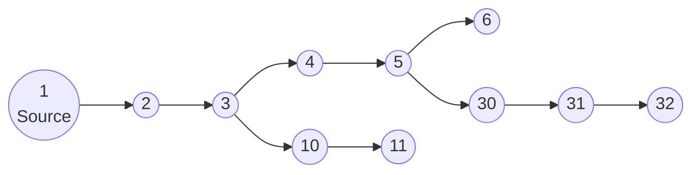
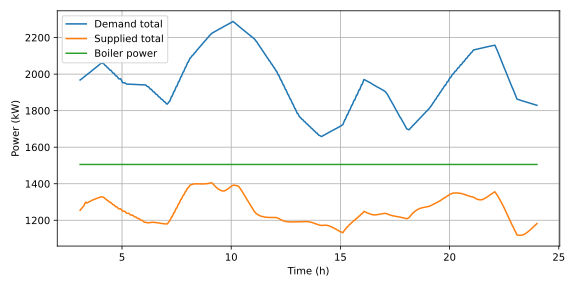
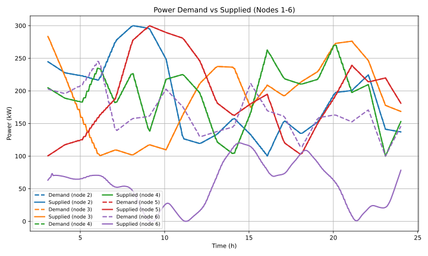
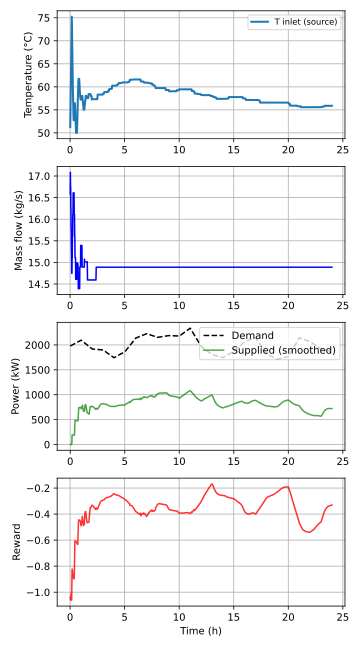
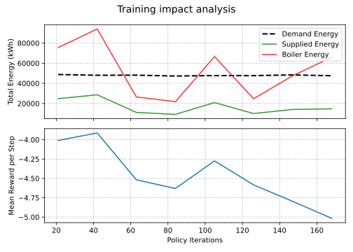

# HeatPilot-RL: District heating network control via reinforcement learning

This project is a research environment simulating the physics of a District Heating Network (DHN) coupled with an Artificial Intelligence (Reinforcement Learning) agent aimed at optimizing heat production.

This document aims to explain:
- how the simulator works,
- what are the physical equations and assumptions,
- what orders of magnitude from real networks guided the sizing,
- how the AI learns to control the network,
- and what are the performances of the trained agent.

---

## 1. Problem overview

A district heating network transports hot water from a production plant to several consumers (buildings) via pipes.

Schema of the main graph used in `config.py`:




**The challenge:**  
- Consumers have a variable power demand to which the agent must adapt dynamically. This is generated randomly in this project, but the power variation is intended to be representative (showers in the morning, heating in the evening...).
- Water takes time to travel through the pipes (thermal delay). An action taken at time $t$ only has an effect at $t+\Delta{t}$.
- If the inlet temperature or flow rate is increased too much: energy consumption (water heating, pumping) and thermal losses (proportional to fluid temperature) increase.
- Conversely, if these values are decreased too much: consumers get cold (discomfort).

**The AI's objective:**  
Anticipate demands and control the temperature and flow rate at the source to satisfy needs while minimizing energy consumption (boiler + pumping).

---

## 2. Sizing context and orders of magnitude

This section explains **the numerical choices of the model** and shows that they are consistent with data available on real district heating networks.

### 2.1. "Typical" network power

The simulated network represents a **small district heating network** with an order of magnitude of:

- **Installed power**: ~2 MW thermal.
- **Number of substations**: typically 5 to 10 consumer nodes.

This choice is consistent with the typology of networks in France:
- **Small collective boiler rooms** (residential neighborhoods, small towns) are generally in the **0.5 to 3 MW** range.
- For real comparison:
  - The biomass boiler of **Montigny-lès-Metz** is **3.5 MW** [^1].
  - The **Hazebrouck** network has a **5 MW** biomass boiler [^2].
  - Industrial boilers (e.g., Bosch Unimat or Viessmann range) commonly cover this range [^3].

A 2 MW network is therefore representative of a local installation, far from metropolitan networks like CPCU Paris (> 3 GW) or La Défense (180 MW) [^4].

### 2.2. Supply / return temperatures

In `config.py`, we typically use:
- Supply temperature: between `temp_min = 50.0 °C` and `temp_max = 120.0 °C`. These are wide bounds; the agent must decide to exploit only a certain amplitude of the range.
- Return temperature: `min_return_temp = 40 °C`, a consumer cannot draw heat from the network if the temperature is lower than or equal to this value.
- Initial network temperature: at network startup, at $t=0$, the temperature of all network cells is initialized to the minimum return temperature. The agent must therefore learn to "start" the network and manage the transient regime.

These values respect current standards:
- Classic networks often operate at **90/70°C** or **80/60°C**.
- Low-temperature networks aim for **70/40°C**.
- The typical differential $\Delta T$ is **20 to 50 K** [^5].

### 2.3. Flow rates and pumping power

In `config.py`,
- The controllable mass flow rate is limited to `flow_min = 3 kg/s`, `flow_max = 30 kg/s`.

For a power of 2 MW and a ΔT of 30 K (e.g., 80/50 °C), the required mass flow rate is:

$$
\dot m \approx \frac{P}{c_p \Delta T}
       \approx \frac{2{\,}000}{4{,}18 \times 30}
       \approx 16\ \text{kg/s}
$$

This flow rate (16 kg/s, or about **57 m³/h**) is consistent for this power.

In the model, the **pumping power** is approximated by:
$$P_{\text{pump}}(t) = 1000 \cdot \dot m(t)$$

This corresponds to a hypothesis of Total Manometric Head (TMH) of about 100 meters of water column (10 bar) with a global efficiency of 60%, which is a realistic order of magnitude to overcome pressure losses in a network of a few kilometers [^6].

### 2.4. Power demand per building / node

In `config.py`, `POWER_PROFILE_CONFIG` defines:

- `p_min = 100 kW`, `p_max = 300 kW` per consumer node.

This corresponds to the peak demand of average collective buildings (about 70-100 W/m²). For example, a 3,000 m² building calls for about 200-300 kW during extreme cold.

---

## 3. Physical modeling (the simulator)

The core of the code is in `district_heating_model.py`. A one-dimensional approach based on the finite volume method is used.

### 3.1. Simplifying assumptions

1. **Incompressibility:**  
   Water is considered incompressible. Mass flow propagates instantly throughout the network (no pressure waves, no hydraulic transient dynamics).
   - For liquid water with low compressibility, typical velocities (0.5–2 m/s) and pressure variations remain moderate. At the thermal time scale (seconds to minutes), pressure dynamics are very fast → we can consider it quasi-static.

2. **Perfect mixing at nodes:**  
   At junctions, flows mix instantly.
   - Mixing volumes in substation chambers or collectors are small compared to pipe lengths, and volumetric mixing times are negligible on the scale of a few seconds.

3. **Uniform insulation:**  
   Linear thermal losses are modeled by a constant `heat_loss_coeff` along each pipe, drawn randomly within a reasonable interval.
   - In real networks, losses are of the order of 5–15% of the energy transported over a year.

4. **Neglected longitudinal conduction (optional):**  
   The diffusive term can be activated but is generally zero or very low. Transport by **advection** dominates in pipes with high $Re$.

### 3.2. The pipe equation

Each pipe is divided into small segments of length $dx$. The temperature evolution $T$ follows:

$$
\frac{\partial T}{\partial t}
= -v \frac{\partial T}{\partial x}
- \frac{4 h}{\rho c_p D}(T - T_{ext})
+ \alpha \frac{\partial^2 T}{\partial x^2}
$$

Where:
- $v$: fluid velocity (m/s),
- $h$: thermal loss coefficient (W/m²/K),
- $D$: pipe diameter,
- $T_{ext}$: ground temperature,
- $\alpha = \lambda / (\rho c_p)$: effective thermal diffusivity (often neglected).

**Numerical discretization (`Pipe.compute_derivatives`):**

For a cell i, a 1st order **upwind** scheme is used:

$$
\frac{dT_i}{dt}
= - \frac{\dot{m}}{\rho A dx}(T_i - T_{i-1})
  - \lambda (T_i - T_{ext})
$$

with:

- $\dot{m}$: mass flow rate (kg/s),
- $A$: inner cross-sectional area of the tube,
- $\lambda = \frac{4 h}{\rho c_p D}$.

The diffusion term can be added via a 3-point scheme (1D Laplacian).

### 3.3. Network and node representation

The network graph is defined by `EDGES` in `config.py` and represented via `Graph` (`graph_utils.py`).

Nodes ensure:

1. **Mass conservation:**

$$
\sum \dot{m}_{in} = \sum \dot{m}_{out}
$$

This conservation is imposed by flow routing via **split fractions** at branching nodes.

2. **Thermal mixing:**

$$
T_{node} = \frac{\sum (\dot{m}_{in} T_{in})}{\sum \dot{m}_{in}}
$$

Calculated in `_solve_nodes_temperature`.

3. **Power withdrawal at consumer nodes:**  
For each consumer node, a power demand $P_{demand}(t)$ is generated (step profile).  
The network supplies power:

$$
P_{supplied} = \dot{m}_{in} c_p (T_{inlet} - T_{return})
$$

In `_apply_node_power_consumption`, a local temperature drop is imposed:

$$
T_{\text{out}} = \max\left(T_{\text{in}} - \frac{P_{\text{supplied}}}{\dot{m}_{\text{in}} c_p},\ T_{\text{min return}}\right)
$$

with $T_{\text{min return}} =$ `MIN_RETURN_TEMP` (40 °C), bounding the return temperature.

**Justification for $T_{\text{min return}}$:** physically, heat transfer stops when the primary circuit temperature (heating network) reaches that of the secondary circuit (building).

---

## 4. The RL environment (gymnasium)

The file `district_heating_gym_env.py` links physics and AI.

### 4.1. Agent and time horizon

- An episode represents **one day**: `t_max_day = 24h`.
- Control step: `dt = 10 s` (the agent takes a decision every 10s).

### 4.2. Observation space (what the agent sees)

The observation is a vector containing:

1. Current temperature at consumer nodes (feedback delayed by transport).
2. Current supply temperature at the source.
3. Current mass flow rate.
4. Current power demand for each consumer.

This information is sufficient to:
- Estimate the current thermal state of the network (via return temperatures),
- Know the instantaneous demand,
- Adapt $T_{in}$ and $\dot m$ to anticipate load variations.

### 4.3. Action space (what the agent controls)

The action is a continuous vector:

1. **Target temperature**: supply temperature setpoint at the source.
2. **Target flow**: target mass flow rate.
3. **Splits**: flow distribution in branches.

**Ramping / dynamic constraints:**

To ensure physical realism and protect simulated equipment, variation constraints are imposed. They are based on technical limits of industrial boilers:

- **Temperature rise**: limited to about **+0.5 to +1.5 °C per 10 seconds**.
  - Hot water boilers tolerate gradients of 3 to 8 K/min (biomass) or even 10-15 K/min (fast gas), i.e., about +0.5 to +2.5 °C/10s [^10].
- **Temperature drop**: limited to about **-0.2 to -0.8 °C per 10 seconds**.
  - Cooling is slower (thermal inertia, no active cooling by the burner). A sudden drop (thermal shock with cold water) is dangerous for the heating body [^11].

These bounds (`max_temp_rise_per_dt`, `max_temp_drop_per_dt`) prevent the agent from adopting overly brutal strategies that would damage a real boiler room.

### 4.4. Cost / reward function

The reward is built to balance thermal comfort and energy sobriety. It is defined in `config.py` (`REWARD_CONFIG`) and calculated at each time step.

$$\text{Reward} = r_{\text{comfort}} + r_{\text{boiler sobriety}} + r_{\text{pump sobriety}}$$

1. **Comfort ($r_{\text{comfort}}$)**: linearly penalizes **under-production** only (consumers are cold). Over-production is not penalized here (it is in the sobriety term).
   
   $$ r_{\text{comfort}} = - A \times \frac{\max(0, P_{\text{demand}} - P_{\text{supplied}})}{P_{\text{ref}}} $$

2. **Production sobriety ($r_{\text{prod sobriety}}$)**: linearly penalizes **over-production** (boiler energy waste).
   
   $$ r_{\text{prod\_sobriety}} = - B \times \frac{\max(0, P_{\text{boiler}} - P_{\text{demand}})}{P_{\text{ref}}} $$

3. **Pumping sobriety ($r_{\text{pump sobriety}}$)**: penalizes deviation from **nominal power** (quadratic) and adds a linear penalty for any excess beyond nominal. This encourages the pump to work around its optimal operating point.
   
   $$ r_{\text{pump\_sobriety}} = - C \times \left[ \left(\frac{P_{\text{pump}} - P_{\text{nom}}}{P_{\text{nom}}}\right)^2 + \max\left(0, \frac{P_{\text{pump}} - P_{\text{nom}}}{P_{\text{nom}}}\right) \right] $$

**Current weights (`config.py`):**
- $A = 1.0$ (Comfort)
- $B = 1.0$ (Boiler sobriety)
- $C = 0.5$ (Pump sobriety)
- $P_{\text{ref}} = 2000$ kW (average power demand)
- $P_{\text{nom}} = 15$ kW

-> add source for nominal pump power

### 4.5. Learning parameters (PPO)

To favor exploration and convergence:
- **Normalization**: `normalize_env = True` (greatly helps convergence and exploration).
- **Entropy**: an entropy coefficient (`ent_coef = 0.05`) forces the agent to explore more at the beginning.
- **Horizon**: the neural network update is done every 2048 steps (~6h simulated) to stabilize the gradient.

---

## 5. Code architecture

Here is how the files interact:

```text
.
├── config.py                       # Global parameters: topology, physics, RL, rewards.
├── district_heating_model.py       # Physics engine: Pipe and DistrictHeatingNetwork classes.
├── run_district_heating_simulation.py # Deterministic simulation "without AI".
├── district_heating_gym_env.py     # Gym Environment: physics <-> RL interface.
├── reward_plot.py                  # Interactive tool to visualize and tune the reward function.
├── train_agent.py                  # PPO training with interactive menu and config management.
├── evaluate_agent.py               # Detailed evaluation of a specific model (time profiles).
├── evaluate_2_agent.py             # Summary evaluation over multiple iterations of the same model (learning curves).
├── graph_utils.py                  # Graph structure and topology.
├── utils.py                        # Utility functions.
├── \models                         # Folder to store trained models
└── \plots                          # Folder to store plots
```

---

## 6. How to run the project?

### 6.1. Prerequisites

Make sure you have installed the dependencies:

```bash
pip install numpy scipy matplotlib gymnasium stable-baselines3
```

### 6.2. Step 1: tune the reward (optional)
### -> review
Use the interactive tool to visualize the impact of weights $A, B, C$ on the reward based on supplied power and flow rate:

```bash
python reward_plot.py
```

### 6.3. Step 2: verify physics

Run a simple simulation without AI to see how the network reacts thermally:

```bash
python run_district_heating_simulation.py
```

This:
- creates a network with randomly generated but reproducible pipes and losses,
- applies power profiles to consumer nodes,
- calculates and plots:

  - total power demanded,
  - total power effectively supplied,
  - power supplied by the boiler,
  - pumping power (if you add its plot).
 
The following graphs were plotted with a constant inlet temperature `inlet_temp = 70 °C` and a constant mass flow rate `inlet_mass_flow = 12 kg/s`.

Mass fractions at branching were not specified, so flow rates were equally distributed to the concerned nodes (50/50).

In this configuration, the values fixed at the inlet are too low to meet the power demand. This is visible on the curves:



The gap between the power delivered by the boiler and the supplied power can be explained by two things:
- Mainly by mass fractions, not parameterized and therefore poorly parameterized. Indeed, heat surpluses can be sent into branches requiring less heat than others. The actual return temperature there is therefore higher than `min_return_temp`.
- But also by conductive-convective losses in the pipes (not quantified).

On the following graph, representing only nodes 1 to 6 (5 nodes are not represented for visibility), we can see that the network manages to supply power to all nodes, except the last one in the chain (node 6). When the power supplied to it reaches zero, it means that the network temperature at this node has reached `min_return_temp = 40 °C`, so power withdrawal is no longer authorized.



### 6.4. Step 3: train the AI

Launch training:

```bash
python train_agent.py
```

The script offers an interactive menu:
1. **Create a new model**: saves the current configuration (`config.py`) in a `run_config.json` file associated with the model to ensure reproducibility.
2. **Resume training**: allows choosing an existing model folder and loads its `run_config.json` configuration to continue training with the same parameters.

- The final model will be saved in `models/PPO_custom_name/`.
- Intermediate checkpoints are created regularly. They are numbered by the number of iterations on the agent's policy.

### 6.5. Step 4: evaluate and visualize

Once training is finished, see how the agent behaves on a test scenario:

```bash
python evaluate_agent.py
```

- This generates `evaluation_results.png` with:
  - supply temperature,
  - temperatures at consumer nodes,
  - flow rate,
  - instantaneous reward.

---

## 7. Results

Among all trained models and tested configurations, the curves below were produced with the most "performant" one.

On the 4 graphs below, we notice 4 interesting things:
- The supplied power is half the demand, **the model is therefore terrible** (even if it is the best I managed to obtain). Is the coefficient of the reward function concerning the comfort criterion too low? After a few trials, I am not convinced that it is solely linked to that.
- The initial network temperature being `min_return_temp = 40 °C`, we observe that **the agent has learned to manage the transient regime** (from $t=0$ to $t=3h$).
- The value of the mass flow rate around which the model stabilizes is not insignificant: it is the nominal value of the pump. Since the reward function penalizes the use of the pump at points other than its nominal point, the model has learned to **stabilize at this nominal operating point**. Note that the model **deviates from this rule for the initial transient phase**, where using the pump at a higher regime is less penalized than the power difference.
- The reward function never reaches zero (the reward function was designed so that this is the theoretical maximum value). The model is therefore satisfied with a **sub-optimum**.



We can observe on the following graph, as a function of the number of updates to the agent's internal policy, the effects of training on:
- the average reward per step of an episode
- the energies supplied and delivered per episode (= per day) (calculated as the integrals of power over the day).

**Why does the reward decrease as iterations progress?**




---

## 8. Other perspectives

### Known limitations and improvement tracks

1. **Hydraulic approximation:**  
   The current model does not take into account detailed hydraulic dynamics (variable manometric head, linear pressure losses, etc.). More precise modeling could improve the reality of simulations.

### Future research tracks

Additional analysis tracks (to be implemented later):

- **Robustness to unconventional demand profiles**: test with demand scenarios different from those seen during training.
- **Comparison of RL policy with a simplified "heating curve"**

---

## 9. References and sources

Technical data used for sizing comes from specialized literature on district heating networks:

[^1]: UEM Metz, [Biomasse Montigny-lès-Metz](https://www.uem-metz.fr/accueil-chauffage-urbain/biomasse-montigny/)
[^2]: Bioénergie Promotion, [Réseau de chaleur d'Hazebrouck](https://www.bioenergie-promotion.fr/96923/le-reseau-de-chaleur-dhazebrouck-maitrise-son-prix-de-lenergie-grace-a-la-biomasse/)
[^3]: Bosch Industrial, [Chaudières industrielles](https://www.bosch-industrial.com/fr/fr/ocs/tertiaire-et-industrie/chaudieres-industrielles-669462-c/)
[^4]: France Chaleur Urbaine, [Données CPCU](https://france-chaleur-urbaine.beta.gouv.fr/reseaux/7501C)
[^5]: CIBE, [Optimisation des réseaux de chaleur](https://cibe.fr/wp-content/uploads/2017/02/51-rct34_optimisationrc.pdf)
[^6]: Xpair, [Solution pompage réseau de chaleur](https://conseils.xpair.com/consulter_savoir_faire/reseaux-chaleur-froid/solution-pompage.htm)
[^7]: Hargassner, [Brochure chaudière industrie](https://www.hargassner.com/wp-content/uploads/2023/10/brochure-chaudiere-industry-hargassner-1.pdf)
[^8]: Babcock Wanson, [Chaudières tubes de fumées](https://www.babcock-wanson.com/fr/categorie-produit/chaudieres-tubes-de-fumees/)
[^9]: Xpair, [Sous-stations réseaux chaleur](https://conseils.xpair.com/consulter_savoir_faire/chauffage-urbain-reseaux-chaleur-multi-energies/sous-stations-reseaux-chaleur.htm)
[^10]: Weishaupt, [Notice technique brûleurs](https://www.weishaupt.fr/uploads/tx_weishaupt_documents/documents/83314504.pdf)
[^11]: National Board, [Preventing Thermal Shock](https://www.nationalboard.org/index.aspx?pageID=164&ID=232)
