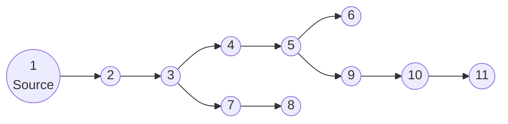
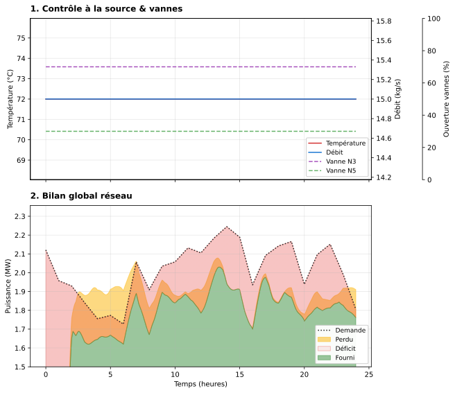
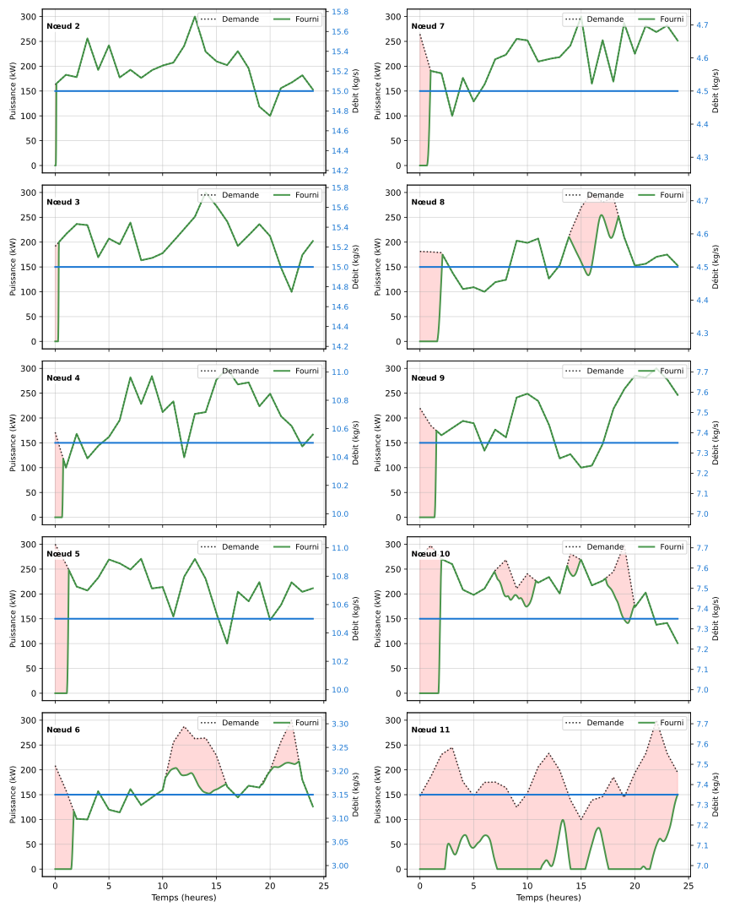
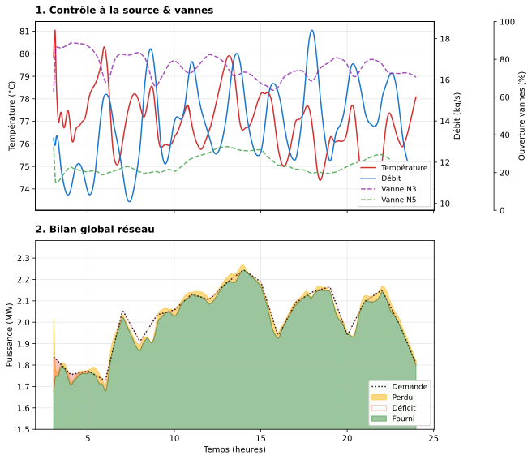
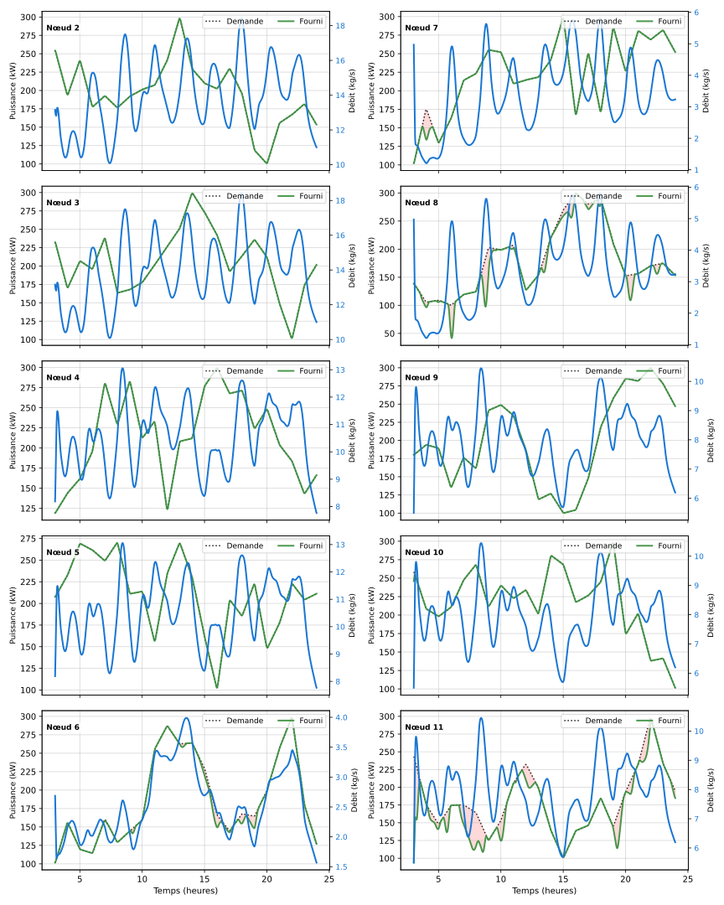
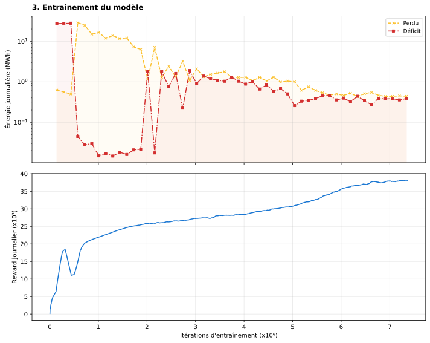

# HeatPilot-RL: District heating network control via reinforcement learning

This project is a research environment simulating the physics of a District Heating Network (DHN) coupled with an Artificial Intelligence (Reinforcement Learning) agent aimed at optimizing heat production.

> **Note:** This project may have very little interest for the sole management of a classic district heating network. However, this approach can be very relevant when controlling heat storage means, intermittent production means (solar thermal), or waste heat recovery in a factory.

This document aims to explain:
- how the simulator works,
- what are the physical equations and assumptions,
- what orders of magnitude from real networks guided the sizing,
- how the agent learns to control the network,
- and what are the performances of the trained agent.

---

## 1. Problem overview

A district heating network transports hot water from a production plant to several consumers (buildings) via pipes.

Schema of the network used (in `config.py`):




**The challenge:**  
- Consumers have a variable power demand to which the agent must adapt dynamically. This is generated randomly in this project, but the power variation is intended to be representative (showers in the morning, heating in the evening...).
- Water takes time to travel through the pipes (thermal delay). An action taken at time $t$ to modify the inlet temperature only has an effect at $t+\Delta{t}$.
- If the inlet temperature or flow rate is increased too much: energy consumption (water heating, pumping) and thermal losses (proportional to fluid temperature) increase.
- Conversely, if these values are decreased too much: consumers get cold (discomfort).

**The AI's objective:**  
Dynamically satisfy the thermal power demand of consumers by controlling the temperature and flow rate at the source as well as the opening of valves at branching nodes, while minimizing energy consumption (boiler + pumping).

No realistic power profile having been implemented, the goal of the agent is not really to anticipate demand variations (at least not in the long term), but really to adapt to them live.

The very goal of the exercise is therefore not representative of reality: in reality, demand is normally predicted and then a network control is set up to approach this prediction, not necessarily to dynamically adapt to demand in real time.

---

## 2. Sizing context and orders of magnitude

This section explains **the numerical choices of the model** and shows that they are consistent with data available on real district heating networks.

### 2.1. "Typical" network power

The simulated network represents a **small district heating network** with an order of magnitude of:

- **Installed power**: ~2 MW thermal.
- **Number of substations**: typically 5 to 10 consumer nodes.

This choice is consistent with the typology of networks in France:
- **Small collective boiler rooms** (residential neighborhoods, small towns) are generally in the **0.5 to 3 MW** range.
- For real comparison:
  - The biomass boiler of **Montigny-lès-Metz** is **3.5 MW** [^1].
  - The **Hazebrouck** network has a **5 MW** biomass boiler [^2].
  - Industrial boilers (e.g., Bosch Unimat or Viessmann range) commonly cover this range [^3].

A 2 MW network is therefore representative of a local installation, far from metropolitan networks like CPCU Paris (> 3 GW) or La Défense (180 MW) [^4].

### 2.2. Supply / return temperatures

In `config.py`, we typically use:
- Supply temperature: between `temp_min = 50.0 °C` and `temp_max = 120.0 °C`. These are wide bounds; the agent will decide to exploit only a certain amplitude of the range.
- Return temperature: `min_return_temp = 40 °C`, a consumer cannot draw heat from the network if the temperature of the water supplying it is lower than or equal to this value. Furthermore, we consider that if the temperature of terminal nodes (at the end of the network) exceeds this temperature, then power has been lost unnecessarily. It is truly a target temperature for the agent.
- Transient regime and warmup: By default, the network undergoes a warmup phase of several (simulated) hours before the agent takes control. During this phase, inlet temperature and flow rate are kept constant. The agent therefore takes over a stabilized ("hot") network and does not have to learn the startup procedure, which simplifies regulation learning.

These values respect current standards:
- Classic networks often operate at **90/70°C** or **80/60°C**.
- Low-temperature networks aim for **70/40°C**.
- The typical differential $\Delta T$ is **20 to 50 K** [^5].

### 2.3. Flow rates and pumping power

In `config.py`,
- The controllable mass flow rate is limited to `flow_min = 3 kg/s`, `flow_max = 30 kg/s`.

For a power of 2 MW and a ΔT of 30 K (e.g., 80/50 °C), the required mass flow rate is:

$$
\dot m \approx \frac{P}{c_p \Delta T}
       \approx \frac{2{\,}000}{4{,}18 \times 30}
       \approx 16\ \text{kg/s}
$$

This flow rate (16 kg/s, or about **57 m³/h**) is consistent for this power.

In the model, the **pumping power** is approximated by:
$$P_{\text{pump}}(t) = 1000 \cdot \dot m(t)$$

This corresponds to a hypothesis of Total Manometric Head (TMH) of about 100 meters of water column (10 bar) with a global efficiency of 60%, which is a realistic order of magnitude to overcome pressure losses in a network of a few kilometers [^6].

### 2.4. Power demand per building / node

In `config.py`, `POWER_PROFILE_CONFIG` defines:

- `p_min = 100 kW`, `p_max = 300 kW` per consumer node.

This corresponds to the peak demand of average collective buildings (about 70-100 W/m²). For example, a 3,000 m² building calls for about 200-300 kW during extreme cold.

Again, demand profiles are generated completely randomly: every hour, a power value is drawn for each node. We ensure that the profiles are "smooth" (no step function).

---

## 3. Physical modeling (the simulator)

The core of the physical model is in `district_heating_model.py`. A one-dimensional approach based on the finite volume method is used.

### 3.1. Simplifying assumptions

1. **Incompressibility:**  
   Water is considered incompressible. Mass flow propagates instantly throughout the network (no pressure waves, no hydraulic transient dynamics).
   - For liquid water with low compressibility, typical velocities (0.5–2 m/s) and pressure variations remain moderate. At the thermal time scale (seconds to minutes), pressure dynamics are very fast → we can consider it quasi-static.

2. **Perfect mixing at nodes:**  
   At junctions, flows mix instantly.
   - Mixing volumes in substation chambers or collectors are small compared to pipe lengths, and volumetric mixing times are negligible on the scale of a few seconds.

3. **Uniform insulation:**  
   Linear thermal losses are modeled by a constant `heat_loss_coeff` along each pipe, drawn randomly within a reasonable interval.
   - In real networks, losses are of the order of 5–15% of the energy transported over a year.

4. **Neglected longitudinal conduction (optional):**  
   The diffusive term can be activated but is generally zero or very low. Transport by **advection** dominates in pipes with high $Re$.

### 3.2. The pipe equation

Each pipe is divided into small segments of length $dx$. The temperature evolution $T$ follows:

$$\frac{\partial T}{\partial t}= -v \frac{\partial T}{\partial x}- \frac{4 h}{\rho c_p D}(T - T_{ext})+ \alpha \frac{\partial^2 T}{\partial x^2}$$

Where:
- $v$: fluid velocity (m/s),
- $h$: thermal loss coefficient (W/m²/K),
- $D$: pipe diameter,
- $T_{ext}$: ground temperature,
- $\alpha = \lambda / (\rho c_p)$: effective thermal diffusivity (often neglected).

**Numerical discretization (`Pipe.compute_derivatives`):**

For a cell i, a 1st order **upwind** scheme is used:

$$\frac{dT_i}{dt}= - \frac{\dot{m}}{\rho A dx}(T_i - T_{i-1})- \lambda (T_i - T_{ext})$$

with:

- $\dot{m}$: mass flow rate (kg/s),
- $A$: inner cross-sectional area of the tube,
- $\lambda = \frac{4 h}{\rho c_p D}$.

The diffusion term can be added via a 3-point scheme (1D Laplacian).

### 3.3. Network and node representation

The network graph is defined by `EDGES` in `config.py` and represented via `Graph` (`graph_utils.py`).

Nodes ensure:

1. **Mass conservation:**

$$
\sum \dot{m}_{in} = \sum \dot{m}_{out}
$$

This conservation is imposed by flow routing via **split fractions** at branching nodes.

2. **Thermal mixing:**

$$
T_{node} = \frac{\sum (\dot{m}_{in} T_{in})}{\sum \dot{m}_{in}}
$$

Calculated in `_solve_nodes_temperature`.

3. **Power withdrawal at consumer nodes:**  
For each consumer node, a power demand $P_{demand}(t)$ is generated (step profile).  
The network supplies power:

$$
P_{supplied} = \dot{m}_{in} c_p (T_{inlet} - T_{return})
$$

In `_apply_node_power_consumption`, a local temperature drop is imposed:

$$
T_{\text{out}} = \max\left(T_{\text{in}} - \frac{P_{\text{supplied}}}{\dot{m}_{\text{in}} c_p},\ T_{\text{min return}}\right)
$$

with $T_{\text{min return}} =$ `MIN_RETURN_TEMP` (40 °C), bounding the return temperature (physically, heat transfer stops when the primary circuit temperature (heating network) reaches that of the secondary circuit (building)).

---

## 4. The RL environment (gymnasium)

The file `district_heating_gym_env.py` links physics and AI.

### 4.1. Agent and time horizon

- An episode represents **one day**: `t_max_day = 24h`.
- Control step: `dt = 60 s` (the agent takes a decision every 60s).

### 4.2. Observation space

The observation is a vector containing:

1. **Current temperatures** of all network nodes (source, consumers).
2. **Current mass flow rates** in every pipe.
3. **Current power demands** for each consumer.

This information is sufficient to:
- Estimate the current thermal state of the network,
- Know the instantaneous demand,
- Adapt $T_{in}$, $\dot m$ and split fractions to anticipate load variations.

### 4.3. Action space

The action is a continuous vector normalized between [-1, 1]. Instead of choosing an absolute target value, the agent chooses a **variation** (delta) to apply to the current state:

1.  **Temperature variation** ($\Delta T$): Percentage of the maximum allowed ramp.
2.  **Flow rate variation** ($\Delta \dot{m}$): Percentage of the maximum allowed ramp.
3.  **Valves variation** ($\Delta \text{split}$): Percentage of the maximum opening/closing speed (for each branching node).

**Allowed ramps (dynamic constraints):**

To ensure physical realism and protect simulated equipment, these variations are bounded by constraints configured in `config.py`. Typical limits are:

-   **Temperature**: Max variation of **±3.0 °C / min**.
    -   Boilers tolerate limited gradients to avoid thermal shocks [^10].
-   **Flow rate**: Max variation of **±3.0 kg/s / min**.
-   **Valves**: Max variation of **±10% opening / min**.

These bounds prevent the agent from adopting unrealistic and dangerous all-or-nothing strategies for equipment.

### 4.4. Cost / reward function

The reward function combines linear penalties (to steer the agent away from critical zones) and Gaussian bonuses (to refine convergence towards the optimum). A "combo" term is also integrated to foster the simultaneous achievement of comfort and sobriety objectives.

$$\text{Reward} = \text{R}_{\text{comfort}} + \text{R}_{\text{sobriety}} + \text{R}_{\text{combo}} + \text{R}_{\text{pump}} + \text{R}_{\text{valves}}$$

Details of terms:

1.  **Comfort ($R_{comfort}$)**:
    *   **Linear penalty**: punishes power deficit (unsatisfied demand ~$P_{demand} - P_{supplied}$).
    *   **Gaussian bonus**: rewards when deficit is close to 0 (target reached).
    *   Weight: `weights["comfort"]`.

2.  **Sobriety ($R_{sobriety}$)**:
    *   **Linear penalty**: punishes wasted heat (produced but not consumed, lost in return).
    *   **Gaussian bonus**: rewards when waste is close to 0.
    *   Weight: `weights["waste"]`.

3.  **Combo Bonus ($R_{combo}$)**:
    *   High reward (`combo_bonus`) awarded only if comfort is ensured (deficit < threshold) AND sobriety is respected (waste < threshold). This helps the agent stabilize an optimal operating point.

4.  **Pumping ($R_{pump}$)**:
    *   **Gaussian bonus** centered on a nominal pump power (`p_pump_nominal`). The agent is encouraged to use a reasonable flow rate, neither too low (thermally inefficient), nor too high (excessive electrical consumption).
    *   Weight: `weights["pump"]`.

5.  **Valves guidance ($R_{valves}$)**:
    *   Learning aid term (implicit curriculum learning). It compares the valve opening chosen by the agent with a **demand-proportional heuristic**.
    *   This heuristic calculates the sum of requested power downstream of each branch at an intersection, and defines the ideal opening (flow fraction) as the ratio of these demands. If a branch serves 80% of the total downstream demand, it receives 80% of the flow.
    *   The agent receives a strong bonus (+2.0) if it is close to this target (gap < 5%), which helps it not to explore absurd hydraulic configurations at the beginning.

**Current weights (`config.py`):**
- Comfort: 4
- Sobriety: 2
- Pump: 5
- Combo: 10

### 4.5. Learning parameters (PPO)

To favor exploration and convergence:
- **Normalization**: `normalize_env = True` (greatly helps convergence and exploration).
- **Entropy**: a relatively low entropy coefficient (`ent_coef = 0.0005`) was chosen, the environment being totally deterministic.
- **Horizon**: the neural network update is done every 1440 steps (24h simulated, i.e., a full episode) to stabilize the gradient over a whole day.

---

## 5. Code architecture

Here is how the files interact:

```text
.
├── config.py                       # Global parameters: topology, physics, RL, rewards.
├── district_heating_model.py       # Physics engine: Pipe and DistrictHeatingNetwork classes.
├── run_district_heating_simulation.py # Deterministic simulation "without AI".
├── district_heating_gym_env.py     # Gym Environment: physics <-> RL interface.
├── train_agent.py                  # PPO training with interactive menu and config management.
├── evaluate_agent.py               # Detailed evaluation of a specific model (time profiles).
├── evaluate_2_agent.py             # Summary evaluation over multiple iterations of the same model (learning curves).
├── graph_utils.py                  # Graph structure and topology.
├── utils.py                        # Utility functions.
├── \models                         # Folder to store trained models
└── \plots                          # Folder to store plots
```

---

## 6. How to run the project?

### 6.1. Prerequisites

Make sure you have installed the dependencies:

```bash
pip install numpy scipy matplotlib gymnasium stable-baselines3
```

### 6.2. Step 1: verify physics

Run a simple simulation without AI to see how the network reacts thermally:

```bash
python run_district_heating_simulation.py
```

This:
- creates a network with randomly generated but reproducible pipes and losses,
- applies power profiles to consumer nodes,
- calculates and plots:

  - total power demanded,
  - total power effectively supplied,
  - power supplied by the boiler,
  - pumping power (if you add its plot).
 
The following graphs were plotted with a constant inlet temperature `inlet_temp = 75 °C` and a constant mass flow rate `inlet_mass_flow = 15 kg/s`.

Mass fractions at branches were specified, but remain constant throughout the simulation.






### 6.3. Step 3: Train the AI

Run training:

```bash
python train_agent.py
```

The script offers an interactive menu:
1. **Create a new model**: saves the current configuration (`config.py`) in a `run_config.json` file associated with the model to ensure reproducibility.
2. **Resume training**: allows choosing an existing model folder and loads its `run_config.json` configuration to continue training with the same parameters.

- The final model will be saved in `models/PPO_custom_name/`.
- Intermediate checkpoints are created regularly. They are numbered by the number of iterations on the agent's policy.

### 6.4. Step 4: evaluate and visualize

Once training is finished, look at how the agent behaves on a test scenario:

```bash
python evaluate_agent.py
```

- This generates `evaluation_results.png` with:
  - supply temperature,
  - temperatures at consumer nodes,
  - flow rate,
  - instantaneous reward.

---

## 7. Results

Here are the results with an agent trained for 3000 episodes.



We can notice that the agent learned to use the pump in its nominal operating zone (around $15\ \text{kg/s}$), and to exploit only the relevant part of the possible inlet temperature range.



Here are the learning curves:



We can perceive that the agent first learned to reduce the deficit (because reward is more important), before seeking to reduce losses.

---

## 8. Other perspectives

### Known limitations and improvement tracks

1. **Hydraulic approximation:**  
   The current model does not take into account detailed hydraulic dynamics (variable manometric head, linear pressure losses, etc.). More precise modeling could improve the reality 
   of simulations.

### Future research tracks

Additional analysis tracks (to be implemented later):

- **Robustness to unconventional demand profiles**: test with demand scenarios different from those seen during training.
- **Comparison of RL policy with a simplified "water law"**

---

## 9. References and Sources

[^1]: UEM Metz, [Biomasse Montigny-lès-Metz](https://www.uem-metz.fr/accueil-chauffage-urbain/biomasse-montigny/)
[^2]: Bioénergie Promotion, [Réseau de chaleur d'Hazebrouck](https://www.bioenergie-promotion.fr/96923/le-reseau-de-chaleur-dhazebrouck-maitrise-son-prix-de-lenergie-grace-a-la-biomasse/)
[^3]: Bosch Industrial, [Chaudières industrielles](https://www.bosch-industrial.com/fr/fr/ocs/tertiaire-et-industrie/chaudieres-industrielles-669462-c/)
[^4]: France Chaleur Urbaine, [Données CPCU](https://france-chaleur-urbaine.beta.gouv.fr/reseaux/7501C)
[^5]: CIBE, [Optimisation des réseaux de chaleur](https://cibe.fr/wp-content/uploads/2017/02/51-rct34_optimisationrc.pdf)
[^6]: Xpair, [Solution pompage réseau de chaleur](https://conseils.xpair.com/consulter_savoir_faire/reseaux-chaleur-froid/solution-pompage.htm)
[^7]: Hargassner, [Brochure chaudière industrie](https://www.hargassner.com/wp-content/uploads/2023/10/brochure-chaudiere-industry-hargassner-1.pdf)
[^8]: Babcock Wanson, [Chaudières tubes de fumées](https://www.babcock-wanson.com/fr/categorie-produit/chaudieres-tubes-de-fumees/)
[^9]: Xpair, [Sous-stations réseaux chaleur](https://conseils.xpair.com/consulter_savoir_faire/chauffage-urbain-reseaux-chaleur-multi-energies/sous-stations-reseaux-chaleur.htm)
[^10]: Weishaupt, [Notice technique brûleurs](https://www.weishaupt.fr/uploads/tx_weishaupt_documents/documents/83314504.pdf)
[^11]: National Board, [Preventing Thermal Shock](https://www.nationalboard.org/index.aspx?pageID=164&ID=232)
